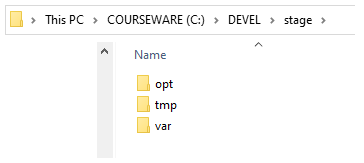

# DCL-302: Nodejs Programming
These projects are created as part of the following training: DCL-302 "Nodejs Programming"

Please follow the link for the complete training catalog: https://www.deepcloudlabs.com/resources

Eğitim öncesinde bilgisayarınıza kurmanız gereken bir çalışma ortamı bulunuyor. Aşağıdaki adımları takip ederek kurulumu gerçekleştirebilirsiniz. Öncelikle aşağıdaki bağlantıda verilen sıkıştırılmış dosyayı makinanıza indirmeniz gerekmektedir: [DEVEL-stage.2022b-nodejs.mongo.webstorm.zip](https://courseware.deepcloudlabs.com/software/DEVEL-stage.2022b-nodejs.mongo.webstorm.zip) 

ZIP formatındaki bu dosyayı indirdikten sonra c:\DEVEL dizinine açmanız kurulum için yeterli olacaktır. 

Bu işlemden sonra c:\DEVEL dizininin görünümü aşağıdaki gibi olmalıdır:

